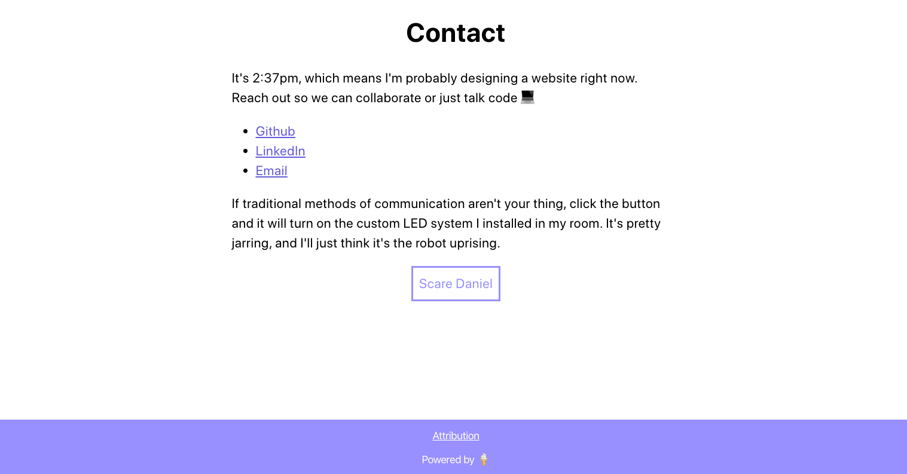

# Portfolio

The deployment can be found at [https://imdan.io/](https://imdan.io/)

## Design Motivation

I wanted to create a portfolio site to exhibit my web development skillset while also showcasing my personality. 
With these goals in mind, I approached the design with these three principals:

* The design should be simplistic. The purpose of the website is to list skills and projects. Therefore, the design should focus on its main purpose.
* It should still feel playful and quirky to showcase different parts of my personality. This is where I decided to implement the lavender coloring throughout.
* It should be unique, hence the 'Scare Daniel' button at the end of the page.

## Installation

#### `npm install`

Installs all the required dependencies. Run this before anything else.

#### `npm start`

Runs the app in the development mode  
Open  [http://localhost:3000](http://localhost:3000/)  to view it in the browser.

The page will reload if you make edits.  
You will also see any lint errors in the console.

#### `npm test`

Launches the test runner in the interactive watch mode.  

## Screenshots

I want the user to form a first impression of me that reflects my playfulness. Hopefully, a visibly terrified avatar of me will do the trick:

After showcasing my projects, I'd like to give the users various ways of reaching out to me, including a way to randomly turn on my smart LEDs:

Always cite your sources:

## Built With

#### Front-end:

* React
* HTML5
* CSS3
* Javascript
* Jest
* Deployed with Zeit

## Deployment

- [Deployment](https://thoughtbin.imdan.io/)

## Authors

* **Daniel DiVenere** -  Development, Deployment, etc - [https://imdan.io/](https://imdan.io/)