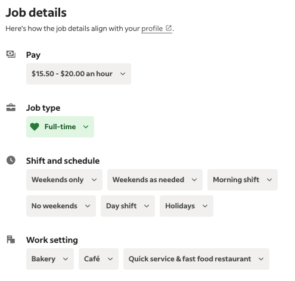

## Why
Having known many restauranters, their most pressing and consistent pain point has been sourcing willing and competent labor. Especially when it comes to small businesses, it can be a struggle to find candidates since [most flock to big name brands for perks](https://www.starbucksbenefits.com/en-us/home/stock-savings/future-roast-401k/) that most nascent businesses can't compete with. To compound, mom-and-pop shops tend to be overlooked since they reside off the busy boulevard corner-lots the larger corporations inhabit. Altogether, this can make it quite difficult to find new people to work with.

I decided to take it into my own hands to level the playing field for small businesses in the arena of finding work. Which is why I'll be building a job board specifically for small business restaurants in Burbank, CA. Think that's niche enough?

My first problem will be solving [the "chicken or the egg" problem](https://www.growthmentor.com/glossary/chicken-and-egg-problem/#:~:text=The%20problem%20occurs%20when%20a,of%20both%20buyers%20and%20sellers.). A job board is a two-sided marketplace: candidates and employers. Which do I attempt to serve first? If I go for businesses first, I will need to have a large pool of candidates actively searching for a job. If I go for candidates, I will need to have a large pool of employers with unfilled positions. Luckily there are already several open datasets of job postings I can pull from and serve under my own site. This will enable me to serve candidates first with existing job postings, build up the candidate traffic, *then* market to businesses in search of candidates. 

So yes, I will be scraping Indeed. I'm just- I'm just scraping [Indeed](https://www.indeed.com/).
## How
After much investigation and internal debate, I've landed on [crawlee](https://crawlee.dev/) and [playwright](https://playwright.dev/) as my tool of choice. Crawlee is purpose-built as a crawler. It has some really neat architectural decisions that keep the code real clean (I'll touch on that in a bit). As for Playwright, it's the latest iteration of [Puppeteer](https://pptr.dev/) and I've always enjoyed Puppeteer's SDK shape.

First thing's first, go ahead and run this command to get a starter project going:
```bash
npx crawlee create my-crawler
```

Once that's done, go ahead and replace the URL where the crawler begins in `main.ts`:
```diff
// For more information, see https://crawlee.dev/
import { PlaywrightCrawler, ProxyConfiguration } from 'crawlee';

import { router } from './routes.js';

- const startUrls = ['https://crawlee.dev/'];
+ const startUrls = ['https://www.indeed.com/jobs?q=[ENTER YOUR DESIRED JOB HERE]&l=Burbank%2C+CA&radius=35'];

const crawler = new PlaywrightCrawler({
    // proxyConfiguration: new ProxyConfiguration({ proxyUrls: ['...'] }),
    requestHandler: router,
    // Comment this option to scrape the full website.
    maxRequestsPerCrawl: 20,
});

await crawler.run(startUrls);
```

Next, we'll want to set up our scraping logic in `routes.ts`:
```ts
import { createPlaywrightRouter } from "crawlee";
import { scrapeButton, scrapeMultiButton } from "./buttonScapers.js";

export const router = createPlaywrightRouter();

// the default handler runs before everything else
router.addDefaultHandler(async ({ enqueueLinks, log }) => {
  log.info(`enqueueing new URLs`);

  // queue up all the job links found in the search results
  await enqueueLinks({
    globs: ["https://www.indeed.com/rc/clk**"],
    label: "job",
  });

  // queue up all the page links found in the pagination buttons
  await enqueueLinks({
    globs: ["https://www.indeed.com/jobs**&start=**"],
    regexps: [new RegExp(/https:\/\/www\.indeed\.com\/jobs.*&start=.*/)],
    label: "new-page",
  });
});

// for every new result page, queue other result pages and job pages
router.addHandler("new-page", async ({ request, page, log, enqueueLinks }) => {
  const urlParams = new URLSearchParams(page.url().split("?")[1]);
  const skip = Number(urlParams.get("start") || 0);

  log.info(`On page ${skip / 10}`);

  // queue up all the job links found in the search results
  await enqueueLinks({
    globs: ["https://www.indeed.com/rc/clk**"],
    label: "job",
  });

  // queue up all the page links found in the pagination buttons
  await enqueueLinks({
    globs: ["https://www.indeed.com/jobs**&start=**"],
    regexps: [new RegExp(/https:\/\/www\.indeed\.com\/jobs.*&start=.*/)],
    label: "new-page",
  });
});

router.addHandler("job", async ({ request, page, log, pushData }) => {
  const url = request.loadedUrl;

  const rawPageTitle = await page.title();
  const pageTitle = rawPageTitle.slice(0, rawPageTitle.length - 13);

  log.info(`${pageTitle}`, { url: request.loadedUrl });

  const urlParams = new URLSearchParams(page.url().split("?")[1]);
  const indeedJobId = urlParams.get("jk");

  const jobTitle = await page.locator("h1 span").textContent();

  const pay = await scrapeButton(page, `[aria-label='Pay'] li div div`);
  const match = pay.match(/\$(\d+(?:\.\d+)?)/); // grab the first string to match `$[NUMBER]`
  const payNumber = match ? parseFloat(match[1]) : null;

  const commitment = await scrapeMultiButton(
    page,
    `[aria-label='Job type'] li div div`
  );
  const schedule = await scrapeMultiButton(
    page,
    `[aria-label='Shift and schedule'] li div div`
  );

  const location = await page.locator("#jobLocationText div").textContent();
  const benefits = await page.locator("#benefits ul li").allInnerTexts();
  const description = await page.locator("#jobDescriptionText").innerHTML();

  await pushData({
    indeedJobId,
    url,
    pageTitle,
    jobTitle,
    pay,
    payNumber,
    commitment,
    schedule,
    location,
    benefits,
    description,
  });
});
```

Crawlee has this incredibly clever routing technique called `label`s. It allows you to queue up other pages for crawling and send those tasks to different "channels" so you can easily compartmentalize your logic. I always ended up with spaghetti code when writing my own crawlers from scratch because I'd have a mess of `for` loops and a ton of deeply nested statements. With this new paradigm, it's easy to keep things clean.

You might be wondering what `scrapeMultiButton` and `scrapeButton` are: they are two helper functions I built to handle this funky UI:


If you want to scrape these as well, here's the implementation in `buttonScrapers.ts`:
```ts
import { Page } from "playwright";

export const scrapeButton = async (page: Page, selector: string) => {
const elementFound = await page.locator(selector).first().isVisible();

  if (!elementFound) {
    return "";
  }

  return await page.locator(selector).first().innerText();
};

export const scrapeMultiButton = async (page: Page, selector: string) => {
  const elementFound = await page.locator(selector).first().isVisible();

  if (!elementFound) {
    return [];
  }

  const buttons = await page.locator(selector).all();
  const buttonTexts = [];


  for (let i = 0; i < buttons.length; i += 3) {
    buttonTexts.push(await buttons[i].innerText());
  }

  return buttonTexts
};
```

Lastly, we'll want to dump this data into a CSV so we can pipe it into our database of choice:
```diff
// For more information, see https://crawlee.dev/
- import { PlaywrightCrawler, ProxyConfiguration } from 'crawlee';
+ import { PlaywrightCrawler, ProxyConfiguration, Dataset } from 'crawlee';

import { router } from './routes.js';

const startUrls = ['https://www.indeed.com/jobs?q=[ENTER YOUR DESIRED JOB HERE]&l=Burbank%2C+CA&radius=35'];

const crawler = new PlaywrightCrawler({
    // proxyConfiguration: new ProxyConfiguration({ proxyUrls: ['...'] }),
    requestHandler: router,
    // Comment this option to scrape the full website.
-    maxRequestsPerCrawl: 20,
+    maxRequestsPerCrawl: 500, // let's also get more results
});

await crawler.run(startUrls);

+await Dataset.exportToCSV('jobs')
```

That's it! Now you just have to run `npm run start:dev`!